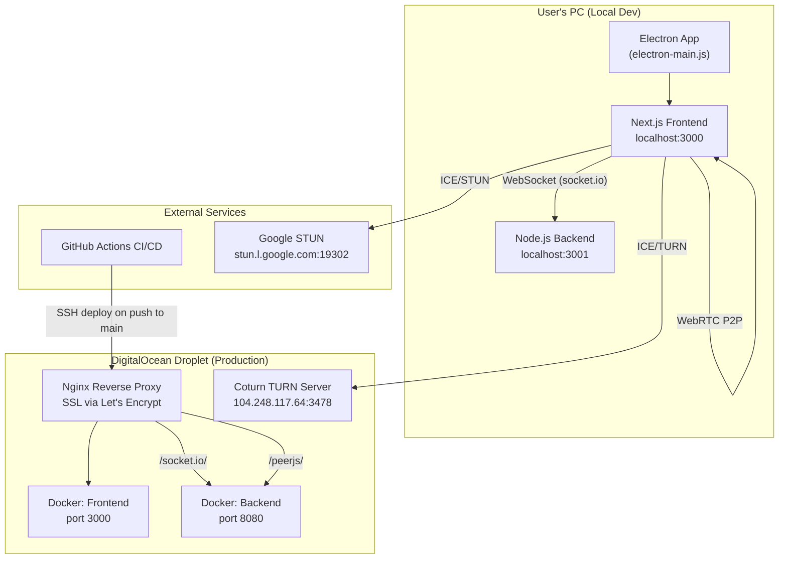

# 🧊 SideView — Full Session Capsule

> **Project**: SideView — Real-time P2P Watch-Together App  
> **Repo**: [https://github.com/SAGEOFCODING/stream-.git](https://github.com/SAGEOFCODING/stream-.git)  
> **Live Domain**: [https://sageofcode.me](https://sageofcode.me)  
> **Date**: June 17, 2026  
> **Author**: Pranav ([@SAGEOFCODING](https://github.com/SAGEOFCODING))

---

## 📐 Architecture Overview



### Tech Stack

| Layer | Technology |
|---|---|
| Frontend | Next.js 16 (App Router), React 19, Tailwind CSS 4, Framer Motion |
| State Management | Zustand |
| Backend (Signaling) | Node.js, Express, Socket.io, PeerJS Server |
| Desktop Wrapper | Electron 42 |
| Infrastructure | DigitalOcean Debian Droplet, Docker Compose, Nginx, Let's Encrypt |
| TURN Server | Self-hosted Coturn at `104.248.117.64:3478` |
| CI/CD | GitHub Actions → SSH → `docker compose up -d --build` |

---

## 🗂️ Key Files & Their Roles

| File | Purpose |
|---|---|
| `frontend/src/hooks/useWebRTC.ts` | Core WebRTC hook — socket.io signaling, ICE/TURN config, peer connections, screen share, mic/camera toggle |
| `frontend/src/app/room/[id]/page.tsx` | Room UI — join screen, video grid, cinema mode, copy link, hide controls |
| `frontend/src/store/useStore.ts` | Zustand global state — local/remote users, streams, cinema mode flags |
| `frontend/src/app/globals.css` | All styles — glassmorphism, cinema mode, hide controls, fullscreen layout |
| `frontend/electron-main.js` | Electron main process — frameless window, screen share picker, IPC handlers |
| `frontend/electron-preload.js` | Electron preload — contextBridge for screen picker & window controls |
| `backend/server.js` | Backend — Socket.io signaling server, room management, PeerJS server, CORS, rate limiting |
| `frontend/.env.local` | Environment vars — socket URL, public URL, TURN credentials |
| `setup_debian.sh` | One-command production deployment script for DigitalOcean |
| `.github/workflows/deploy.yml` | GitHub Actions CI/CD — auto-deploy on push to `main` |
| `frontend/next.config.ts` | Next.js config — standalone output, security headers, Permissions-Policy |

---

## 🐛 Issues Debugged & Resolved

### 1. Audio Sharing on Non-Chromium Browsers
**Problem**: Firefox and Safari cannot share system/tab audio via `getDisplayMedia`.  
**Root Cause**: Browser limitation — the W3C Screen Capture spec includes audio, but Firefox ([Bug 1541425](https://bugzilla.mozilla.org/show_bug.cgi?id=1541425)) and Safari have not implemented it.  
**Solution in Code**: `useWebRTC.ts` uses a 3-tier fallback:
1. Chrome-specific `suppressLocalAudioPlayback` constraint
2. Standard `audio: true`
3. Video-only fallback

Then validates with `screenStream.getAudioTracks().length === 0` and warns the user.  
**Verdict**: This is a browser-level limitation. Users must use Chromium-based browsers for system audio.

---

### 2. Screen Freeze When Going Fullscreen
**Problem**: Shared screen freezes on last frame when switching to fullscreen or switching apps.  
**Root Cause**: Two possible causes:
- **Window capture + fullscreen**: OS changes window handle, WebRTC loses the capture source
- **DRM protection**: Netflix/Prime block screen capture in fullscreen  

**Solution**: 
- Share **Entire Screen** or **Chrome Tab** instead of a specific Window
- Disable Hardware Acceleration in Chrome (`Settings → System → Use graphics acceleration → OFF`) to bypass DRM

---

### 3. App Flickering / Not Opening
**Problem**: Electron app was flickering and not rendering.  
**Root Cause**: Invalid capture constraints and hardware acceleration conflicts.  
**Solution**: Fixed capture constraints in useWebRTC.ts, kept hardware acceleration enabled in Electron for smooth rendering.

---

### 4. `xhr poll error` — Socket.io Connection Failures
**Problem**: Remote users connecting through `localtunnel` got "xhr poll error".  
**Root Cause**: Localtunnel's interstitial warning page was intercepting Socket.io polling requests.  
**Solution**: Added `bypass-tunnel-reminder: true` header to the socket.io client config:
```typescript
socketRef.current = io(SOCKET_SERVER_URL, {
  reconnectionAttempts: 5,
  reconnectionDelay: 1000,
  timeout: 10000,
  extraHeaders: {
    "bypass-tunnel-reminder": "true"
  }
});
```

---

### 5. Wrong URL in "Copy Room Link"
**Problem**: Copy button was giving `localtunnel` URLs (`metal-laws-judge.loca.lt`) instead of the production domain.  
**Explanation**: This was actually *correct behavior* — the localtunnel URL was the public share link. But since we're moving to production on `sageofcode.me`, we updated the copy logic.  
**Current Solution**: `page.tsx` copyLink function replaces `localhost:3000` with `NEXT_PUBLIC_PUBLIC_URL` (now `https://sageofcode.me`).

---

### 6. Localtunnel 408 Timeout
**Problem**: `metal-laws-judge.loca.lt` showed "408 Request Timeout" error page.  
**Root Cause**: Localtunnel connections drop after extended idle periods.  
**Solution**: Restarted tunnel processes. Now deprecated in favor of production deployment.

---

## ✨ Features Added This Session

### Hide Controls (Press H)
- **Toggle button** and **keyboard shortcut `H`** to hide all UI controls
- Video player expands to `96vw × 92vh` in hidden mode
- CSS classes: `.controls-hidden`, `.show-controls-btn`
- Committed: `4c6c38d feat: add hide controls, make screen larger, and fix WebRTC connection issues`

### Production Domain Pointing
- Updated `frontend/.env.local`:
  ```env
  NEXT_PUBLIC_SOCKET_URL=https://sageofcode.me
  NEXT_PUBLIC_PUBLIC_URL=https://sageofcode.me
  ```
- Simplified `getSocketUrl()` — removed localhost override so it always uses the env var:
  ```typescript
  function getSocketUrl() {
    return process.env.NEXT_PUBLIC_SOCKET_URL || 'https://sageofcode.me';
  }
  ```
- **Verified**: "Copy Room Link" button now copies `https://sageofcode.me/room/XXXX`

---

## 🚀 Production Deployment — How It Works

### The Droplet (sageofcode.me)
Your DigitalOcean droplet at `sageofcode.me` runs:
- **Nginx** as reverse proxy with SSL (Let's Encrypt)
- **Docker Compose** with two containers:
  - `frontend` (Next.js on port 3000)
  - `backend` (Socket.io + PeerJS on port 8080)
- **Coturn TURN server** at `104.248.117.64:3478` for NAT traversal

### Nginx Routing
```
https://sageofcode.me/          → frontend (port 3000)
https://sageofcode.me/socket.io/ → backend (port 8080)
https://sageofcode.me/peerjs/    → backend (port 8080)
```

### CI/CD Pipeline
Every `git push` to `main` triggers `.github/workflows/deploy.yml`:
1. SSH into droplet
2. `cd /opt/sideview && git pull origin main`
3. `docker compose up -d --build`
4. `docker image prune -f`

### Required GitHub Secrets
| Secret | Value |
|---|---|
| `DROPLET_IP` | Your droplet's public IP |
| `DROPLET_USERNAME` | SSH user (e.g., `root`) |
| `DROPLET_SSH_KEY` | Private SSH key for the droplet |

### One-Command Fresh Setup
```bash
bash setup_debian.sh
# Prompts for: domain name, TURN server config
# Installs: Docker, Nginx, Certbot, builds & starts containers
```

---

## 🔧 Current Environment Configuration

### `frontend/.env.local`
```env
NEXT_PUBLIC_SOCKET_URL=https://sageofcode.me
NEXT_PUBLIC_PUBLIC_URL=https://sageofcode.me
NEXT_PUBLIC_TURN_URL="turn:104.248.117.64:3478"
NEXT_PUBLIC_TURN_USERNAME="root"
NEXT_PUBLIC_TURN_CREDENTIAL="sideview123"
```

### ICE Servers (configured in useWebRTC.ts)
```
STUN: stun:stun.l.google.com:19302
STUN: stun:global.stun.twilio.com:3478
STUN: stun:stun.cloudflare.com:3478
TURN: turn:104.248.117.64:3478 (username: root, credential: sideview123)
```

---

## 📋 Git Status

- **Branch**: `main`
- **Remote**: `origin → https://github.com/SAGEOFCODING/stream-.git`
- **Last commit pushed**: `4c6c38d feat: add hide controls, make screen larger, and fix WebRTC connection issues`
- **Uncommitted changes**: 6 lines removed from `useWebRTC.ts` (the localhost override in `getSocketUrl()`)
- **`.env.local` is gitignored** — the production env vars on the droplet are baked into Docker build args via `setup_debian.sh`

> [!IMPORTANT]
> The `useWebRTC.ts` change (removing localhost override) is **NOT yet committed or pushed**. You need to commit and push this to trigger the CI/CD pipeline and update production.

---

## ⏭️ Outstanding Next Steps

### Must Do (to go fully public)
1. **Commit & push** the `useWebRTC.ts` change to trigger CI/CD deployment
2. **Verify the droplet is running** — the `curl` test to `sageofcode.me` timed out during this session, which could mean:
   - The droplet is powered off
   - Docker containers are stopped
   - Nginx/SSL cert expired
3. **SSH into the droplet** and check `docker compose ps` and `nginx -t`

### Nice to Have
- **Add a local dev mode switch**: When developing locally, you may want socket to connect to `localhost:3001` again. Consider using `NODE_ENV` or a `NEXT_PUBLIC_DEV_MODE` flag instead of hardcoding hostname detection.
- **Redis adapter for Socket.io**: Currently using in-memory room storage. For scaling beyond one server, add Redis.
- **Video sync controls**: Play/pause synchronization between host and viewers.
- **Chat feature**: Text chat within rooms.

---

## 🧠 Key Technical Knowledge

### How Multi-User Connectivity Works
1. **Host** creates a room at `https://sageofcode.me/room/XXXXX`
2. Host clicks **Copy Room Link** → copies `https://sageofcode.me/room/XXXXX`
3. **Friend** opens that link in their browser → connects to the same Socket.io backend
4. Socket.io sends signaling messages (SDP offers/answers, ICE candidates) between peers
5. WebRTC establishes a **direct P2P connection** between the host and friend
6. If direct connection fails (firewall/NAT), traffic routes through the **TURN server** at `104.248.117.64`

### Why Electron?
- Bypasses browser DRM restrictions for screen sharing
- Custom frameless window with drag-to-move title bar
- Native screen share picker via `desktopCapturer`
- Always-on-top pin feature for overlay mode

### Screen Share Fallback Chain (useWebRTC.ts)
```
Tier 1: getDisplayMedia({ audio: { suppressLocalAudioPlayback: false } })  ← Chrome-specific
  ↓ fails
Tier 2: getDisplayMedia({ audio: true })  ← Standard
  ↓ fails
Tier 3: getDisplayMedia({ video: true })  ← Video only
```

---

## 📁 Project Directory Structure
```
Sideview/
├── .github/workflows/deploy.yml    # CI/CD pipeline
├── backend/
│   ├── Dockerfile
│   ├── server.js                   # Socket.io + PeerJS signaling
│   └── package.json
├── frontend/
│   ├── .env.local                  # Environment variables
│   ├── Dockerfile
│   ├── electron-main.js            # Electron main process
│   ├── electron-preload.js         # Electron preload bridge
│   ├── next.config.ts              # Next.js config
│   ├── package.json
│   └── src/
│       ├── app/
│       │   ├── globals.css         # All styles
│       │   ├── page.tsx            # Landing page
│       │   └── room/[id]/page.tsx  # Room page
│       ├── components/
│       │   └── TitleBar.tsx        # Custom Electron title bar
│       ├── hooks/
│       │   └── useWebRTC.ts        # WebRTC + signaling hook
│       └── store/
│           └── useStore.ts         # Zustand state
├── setup_debian.sh                 # One-command server setup
├── docker-compose.yml
└── README.md
```
